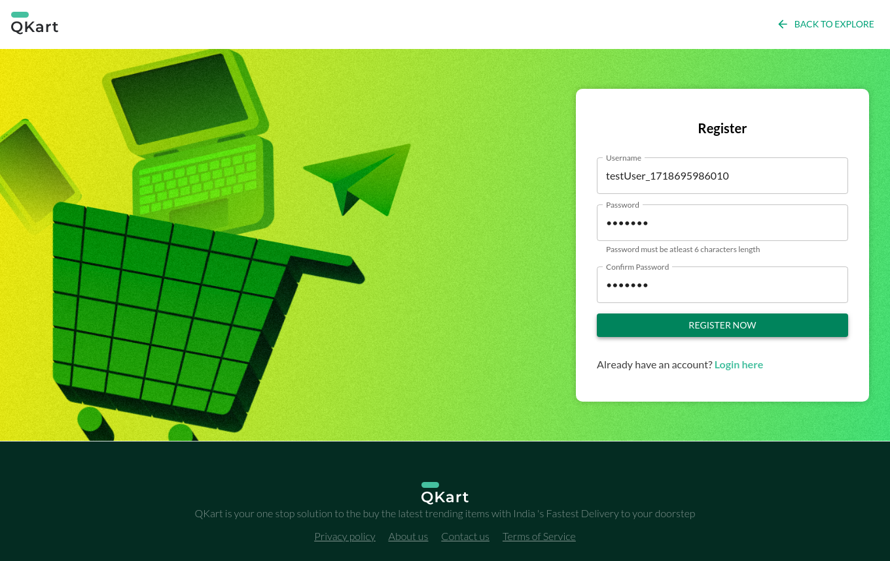
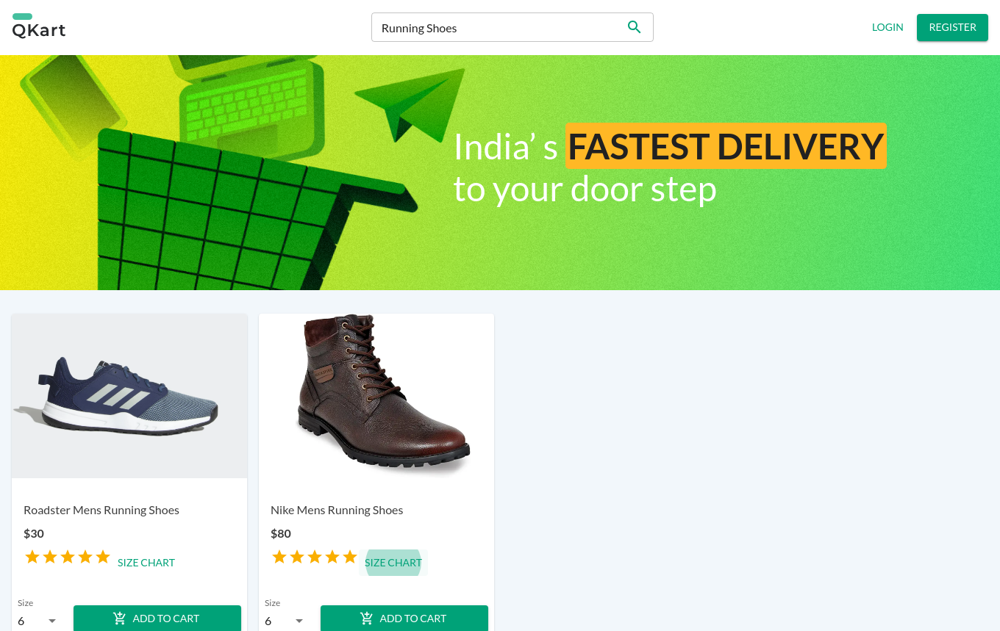
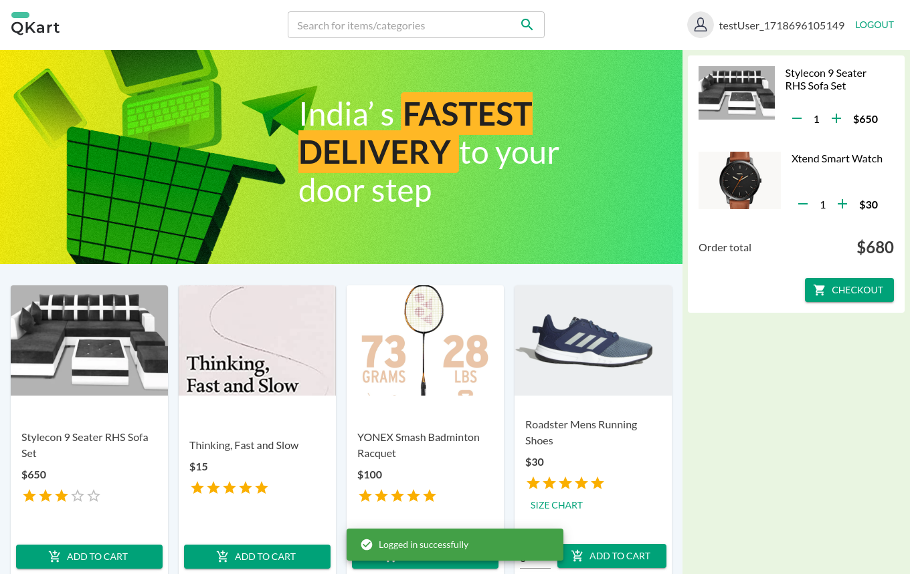

## Introduction
The project covers different scenarios to validate the functionality and behavior of the E-Commerce application.

## Test Cases

<b>Test Case 1: Verify User Registration and Login | PASS</b>

<ul>

Details

- **Objective**: To verify that a new user can successfully register and login with valid credentials.
- **Steps**:
  1. Navigate to the user Registration page of QKart
  2. Enter the username and password
  3. Enter the confirm password
  4. Click on the Register button
  5. Navigate to the Login page
  6. Login with the the newly created user credentials

Screenshots

</ul>

<b>Test Case 2: Verify if user Reregistration using the same username is not allowed | PASS</b>

<ul>

Details

- **Objective**: To verify that the registration process prevents using an existing username.
- **Steps**:
  1. Navigate to the Registration page of QKart
  2. Enter the user name of an existing user
  3. Enter password and confirm password
  4. Click on the Register button

Screenshots

</ul>

<b>Test Case 3: Verify functionality of the search box | PASS</b>

<ul>

Details

- **Objective**: To verify that All results displayed on the page should contain the name 'yonex'', There should be a 'No products found' message
- **Steps**:
  1. Navigate to home page
  2. Search for text : 'yonex' in the search box
  3. Ensure that the results shown contain the search text in their name
  4. Search for text: 'Gesundheit'
  5. Ensure that no products found message is displayed

Screenshots

</ul>

<b>Test Case 4: Verify the presence of Size Chart | PASS</b>

<ul>

Details

- **Objective**: Size chart Link should be present, On Click  the size chart should be displayed, The contents of the size chart are correct, The Size Selection drop down must be present for items with size chart, Each size present in the size selection dropdown must have corresponding entry on the size chart
- **Steps**:
  1. Navigate to home page
  2. Search for text: 'UNIFACTOR Mens Running Shoes'
  3. Verify that the Size Chart Link Exists
  4. Click on the size chart link and check the contents of the size chart
  5. Verify the existence of size selection drop down
  6. Ensure each size present in the size selection dropdown has corresponding reference on the size chart

Screenshots

</ul>

<b>Test Case 5: Happy Flow Test Completed | PASS</b>

<ul>

Details

- **Objective**: To verify the The user is re-directed to the checkout page, The contents of the cart on the checkout page should be correct, The user should be redirect to the order success page, Order successful message should be displayed
- **Steps**:
  1. Register a new user
  2. Login using this new user
  3. Add the following products in to the cart 'YONEX Smash Badminton Racquet x 1', 'Tan Leatherette Weekender Duffle x1'
  4. Click on Checkout
  5. Add a new address
  6. Select the added address using radio button
  7. Click on Place order
  8 . Ensure that the order is placed

Screenshots

</ul>

<b>Test Case 6: Verify that cart can be edited | PASS</b>

<ul>

Details

- **Objective**: To verify that the The Cart on the checkout page should contain the following items 'The Minimalist Slim Leather Watch x1'
- **Steps**:
  1. Navigate to the home page
  2. Add the follwing products to the cart 'The Minimalist Slim Leather Watch x2', 'Bonsai Spirit Tree Table Lamp x1'
  3. Remove 1 Qty of The Minimalist Slim Leather Watch from the cart
  4. Remove 1 Qty of Bonsai Spirit Tree Table Lamp from the cart
  5. Click on Checkout
  6. Verify the contents of cart on the checkout page
  7. Log out

Screenshots

</ul>

<b>Test Case 7: Verify that cart contents are persisted after logout | PASS</b>

<ul>

Details

- **Objective**: To verify that the The Checkout button must be present as there are items already added to the cart, The contents of the cart must be 'Stylecon 9 Seater RHS Sofa Set x1', 'The Minimalist Slim Leather Watch x3'
- **Steps**:
1. Register a new user
2. Login using the registered user
3. Add the following items in the cart: 'Stylecon 9 Seater RHS Sofa Set x1', 'The Minimalist Slim Leather Watch x3'
4. Logout
5. Login using the same user
6. Verify the existence of checkout button
7. Verify the existence of the items added to cart

Screenshots

</ul>

<b>Test Case 8: Verify that insufficient balance error is thrown when the wallet balance is not enough | PASS</b>

<ul>

Details

- **Objective**: To verify that an insufficient balance error is thrown when the wallet balance is not enough to place an order.
- **Steps**:
1. Register a new user
2. Login using the registered user
3. Add the following items in the cart 'Stylecon 9 Seater RHS Sofa Set x10'
4. Check out
5. Add a new address
6. Select the added address using radio button
7. Click on Place order
8. Verify if the order is placed

Screenshots

</ul>

<b>Test Case 9: Verify that product added to cart is available when a new tab is opened | PASS</b>

<ul>

Details

- **Objective**: To verify that a product added to the cart is available when a new tab is opened.
- **Steps**:
1. Register a new user
2. Login with the newly created user
3. Search for th e product 'YONEX Smash Badminton Racquet''
4. Add the above mentioned product to the cart
5. Open a new tab and go to the QKART home page
6. Check if the product added in step 4 is present in the cart

Screenshots

</ul>

<b>Test Case 10: Verify that the Privacy Policy, About Us are displayed correctly | PASS</b>

<ul>

Details

- **Objective**: To verify that the Privacy Policy and About Us pages are displayed correctly.
- **Steps**:
1. Navigate to QKART page
2. Click on the Privacy Policy Link
3. Click on the about us Link

Screenshots

</ul>

<b>Test Case 11: Verify that contact us option is working correctly  | PASS</b>

<ul>

Details

- **Objective**: To verify that the Contact Us option is working correctly.
- **Steps**:
1. Navigate to QKART page
2. Click on the contact us link
3. Update the contact us details
4. Click on close

Screenshots

</ul>

<b>Test Case 12:  Ensure that the links on the QKART advertisement are clickable | PASS</b>

<ul>

Details

- **Objective**: To ensure that the links on the QKART advertisement are clickable.
- **Steps**:
1. Navigate to QKART page
2. Register a new user
3. Login using the registered user
4. Search for product: 'YONEX Smash Badminton Racquet'
5. Buy the product
6. In the last page, check if the advertisement links are clickable

Screenshots

</ul>

## Results

12 out of 12 test cases Passed
