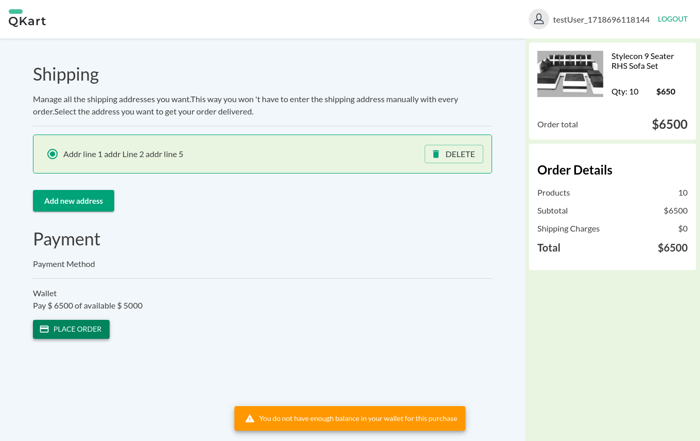
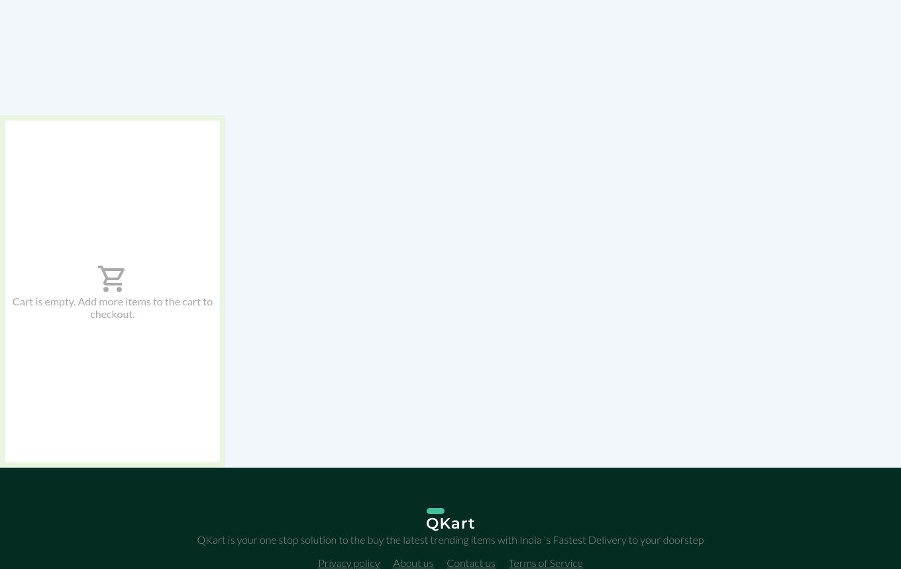
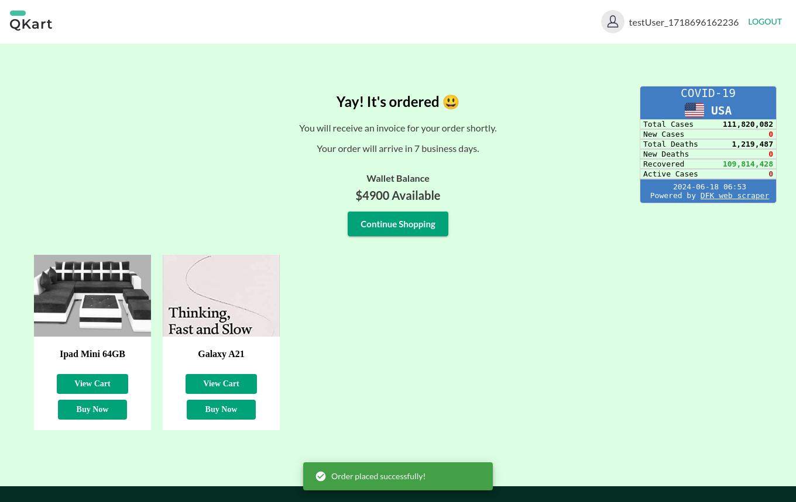

## Introduction
The project covers different scenarios to validate the functionality and behavior of the E-Commerce application.

## Test Cases

<b>TestCase01: Verify User Registration with valid credentials</b>

<ul>

Details

- **Objective**: To verify that a new user can successfully register with valid credentials.
- **Steps**:
  1. Navigate to the registration page.
  2. Enter valid user details (username, password, etc.).
  3. Click on the registration button.
  4. Verify if the registration is successful and the user is redirected to the home page.

Screenshots

</ul>

<b>TestCase02: Verify User Registration with an existing username</b>

<ul>

Details

- **Objective**: To verify that the registration process prevents using an existing username.
- **Steps**:
  1. Navigate to the registration page.
  2. Enter an existing username and valid credentials.
  3. Click on the registration button.
  4. Verify if the registration fails and displays an appropriate error message.

Screenshots

</ul>

<b>TestCase03: Verify Login with valid credentials</b>

<ul>

Details

- **Objective**: To verify that a registered user can login with valid credentials.
- **Steps**:
  1. Navigate to the login page.
  2. Enter valid username and password.
  3. Click on the login button.
  4. Verify if the login is successful and the user is redirected to the home page.

Screenshots

</ul>

<b>TestCase04: Verify Login with invalid credentials</b>

<ul>

Details

- **Objective**: To verify that the login process fails with invalid credentials.
- **Steps**:
  1. Navigate to the login page.
  2. Enter invalid username and password.
  3. Click on the login button.
  4. Verify if the login fails and an appropriate error message is displayed.

Screenshots

</ul>

<b>TestCase05: Verify Happy Flow of buying products</b>

<ul>

Details

- **Objective**: To verify the happy flow of buying products from the website.
- **Steps**:
  1. Register a new user.
  2. Login with the newly registered user's credentials.
  3. Add products to the cart.
  4. Go to the checkout page and place the order.
  5. Verify if the order is placed successfully.

Screenshots

</ul>

<b>TestCase06: Verify that cart can be edited</b>

<ul>

Details

- **Objective**: To verify that the cart can be edited by adding/removing products.
- **Steps**:
  1. Register a new user.
  2. Login with the newly registered user's credentials.
  3. Add products to the cart.
  4. Update the quantity of products in the cart.
  5. Verify if the cart is updated accordingly.

Screenshots

</ul>

<b>TestCase07: Verify that cart contents are persisted after logout</b>

<ul>

Details

- **Objective**: To verify that the cart contents are persisted even after the user logs out.
- **Steps**:
  1. Register a new user.
  2. Login with the newly registered user's credentials.
  3. Add products to the cart.
  4. Log out the user.
  5. Log in again with the same user's credentials.
  6. Verify if the cart contents are still present.

Screenshots

</ul>

<b>TestCase08: Verify that insufficient balance error is thrown when the wallet balance is not enough</b>

<ul>

Details

- **Objective**: To verify that an insufficient balance error is thrown when the wallet balance is not enough to place an order.
- **Steps**:
  1. Register a new user.
  2. Login with the newly registered user's credentials.
  3. Add products to the cart with a high quantity.
  4. Go to the checkout page and place the order.
  5. Verify if the insufficient balance error message is displayed.

Screenshots

</ul>

<b>TestCase09: Verify that product added to cart is available when a new tab is opened</b>

<ul>

Details

- **Objective**: To verify that a product added to the cart is available when a new tab is opened.
- **Steps**:
  1. Register a new user.
  2. Login with the newly registered user's credentials.
  3. Add a product to the cart.
  4. Open a new tab and navigate to the website.
  5. Verify if the cart contents are still present.

Screenshots

</ul>

<b>TestCase10: Verify that the Privacy Policy, About Us are displayed correctly</b>

<ul>

Details

- **Objective**: To verify that the Privacy Policy and About Us pages are displayed correctly.
- **Steps**:
  1. Register a new user.
  2. Login with the newly registered user's credentials.
  3. Click on the Privacy Policy link.
  4. Verify if the Privacy Policy page is displayed correctly.
  5. Click on the About Us link.
  6. Verify if the About Us page is displayed correctly.

Screenshots

</ul>

<b>TestCase11: Verify that contact us option is working correctly</b>

<ul>

Details

- **Objective**: To verify that the Contact Us option is working correctly.
- **Steps**:
  1. Navigate to the Contact Us page.
  2. Enter name, email, and message.
  3. Click on the Contact Us button.
  4. Verify if the Contact Us form submission is successful.

Screenshots

</ul>

<b>TestCase12: Ensure that the links on the QKART advertisement are clickable</b>

<ul>

Details

- **Objective**: To ensure that the links on the QKART advertisement are clickable.
- **Steps**:
  1. Register a new user.
  2. Login with the newly registered user's credentials.
  3. Add a product to the cart.
  4. Go to the checkout page and place the order.
  5. Verify if the QKART advertisements are displayed.
  6. Verify if the links on the QKART advertisements are clickable.

Screenshots

</ul>

